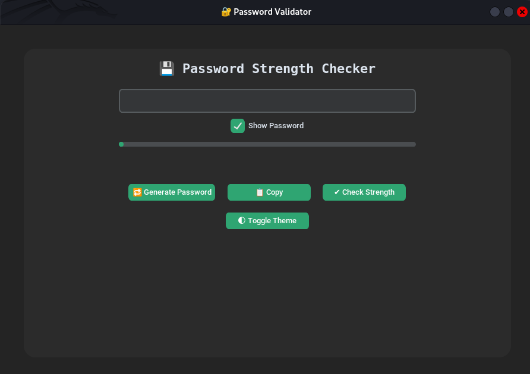
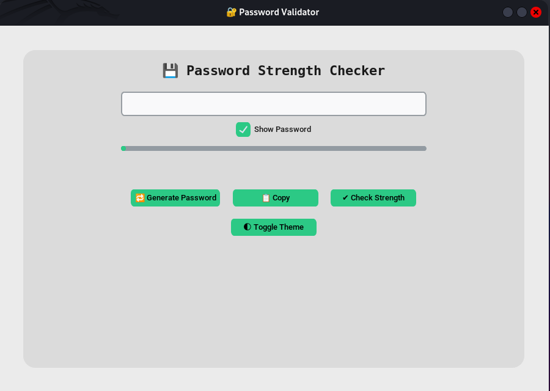
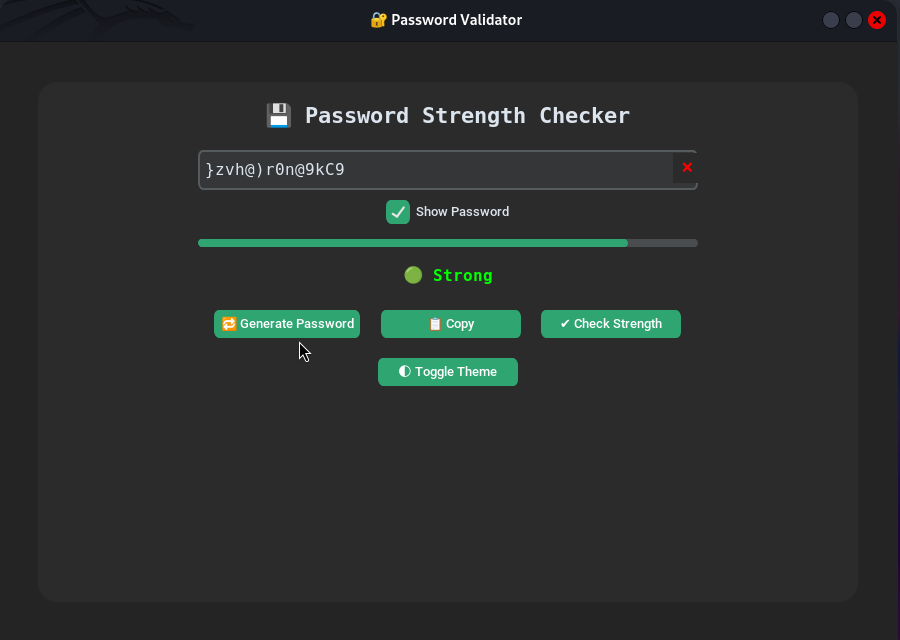
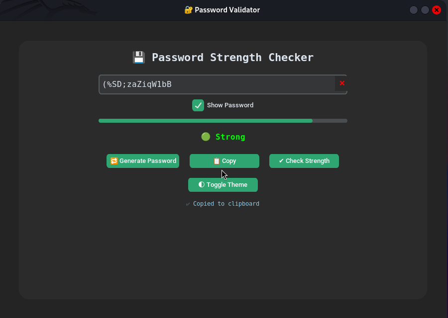
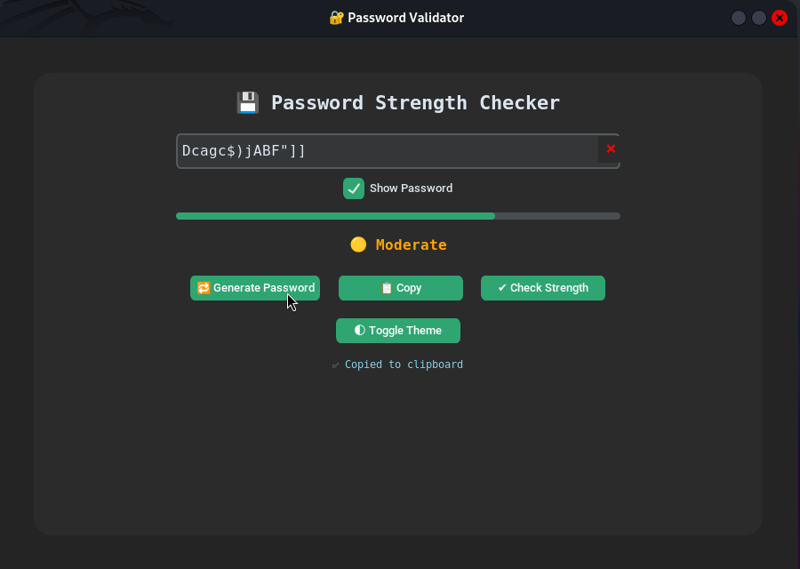
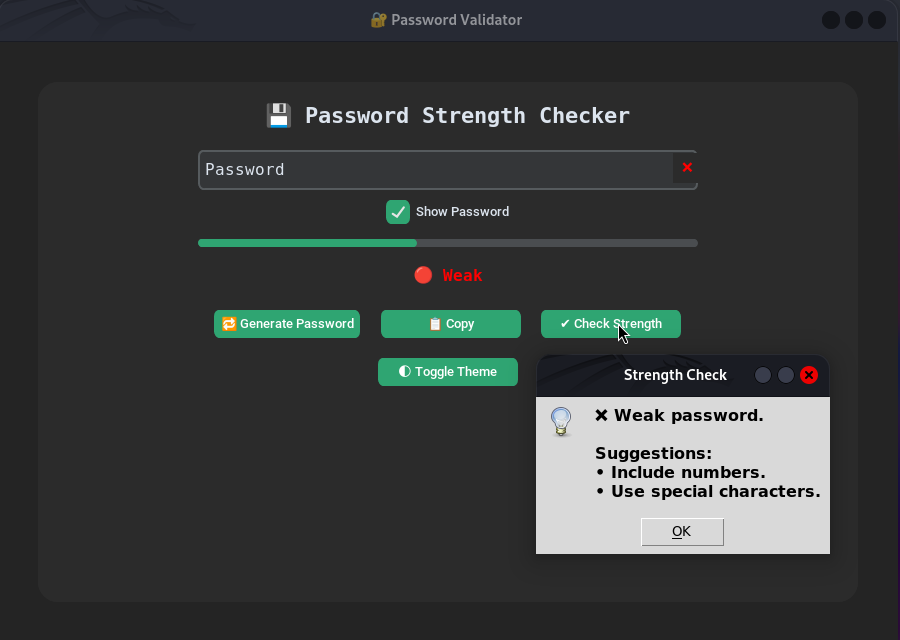

# 🔐 Password Strength Checker

A real-time password strength evaluator with a modern GUI built using Python and `customtkinter`. This tool helps users generate, evaluate, and improve password security using visual cues and suggestions.

---

## 🎯 Objective

Analyze password strength using:

- Length & complexity checks  
- Upper/lowercase, digit, and special character validations  
- Real-time progress bar and feedback  
- Instant suggestions to improve password security

---

## ✨ Features

- ✅ Real-time password strength meter  
- 🔁 Password generator  
- 📋 Clipboard copy support  
- 🌓 Toggle between light/dark themes 
- 🔒 Show/hide password toggle  
- 📊 Visual strength bar with live updates  
- ⚡ Fully adaptive layout (resizes for any screen)

---

## 📁 Folder Structure

| File/Folder                 | Description                            |
|-----------------------------|----------------------------------------|
| `cyber_password_checker.py` | Main GUI Python file                   |
| `README.md`                 | This project documentation             |
| `venv/`                     | (Optional) Python virtual environment  |
| `output`                    | Output images of the project           |

---

## ⚙️ Setup Instructions

### 🔽 1. Clone the Repository

git clone https://github.com/Ragul0812/password-checker.git
cd password-checker

### 🧪 2. Create a Virtual Environment (Recommended)
🔧 On Windows:

python -m venv venv
venv\Scripts\activate

🐧 On Kali Linux / Ubuntu:

python3 -m venv venv
source venv/bin/activate

### 📦 3. Install Required Package

~ pip install customtkinter

If you're on Kali Linux, use this instead (to avoid system package issues):

~ pip install --break-system-packages customtkinter

### 🚀 4. Run the Application

On Kalilinux:

python3 cyber_password_checker.py

On Windows:

python cyber_password_checker.py

## 🧰 Technologies Used

~ **Python 3**

~ **customtkinter** – Modernized Tkinter GUI

~ **re** – Regex for strength evaluation

~ **pyperclip** – Clipboard copy support

~ **random & string** – Password generation

~ **Responsive Grid Layout** – for all screen sizes

## 📸 Project output

Here are sample screenshots from the tool:

### 🖥️ Main Interface

### Generating Password

### ✅ Strong Password

### ⚠️ Moderate Password

### ❌ Weak Password

### ⚠️ Notes

Make sure xclip is installed in Linux for clipboard support if needed:

~ sudo apt install xclip

This project is intended for educational use only.

Use responsibly and never to harm or deceive others.
